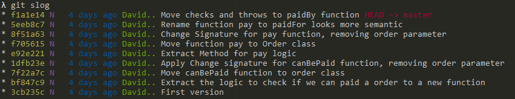

# kotlin-template

Custom Kotlin template project for Katas

## Transformation Priority Premise

Sometimes we need remember how much code is... too much code :) 
You have an [Transformation Priority Premise](TPP.md) to guide your code :sparkles:  

##Gradle tasks

```bash
./gradlew setLocalEnv
```
 
  
This gradle task will config the following commands in your local repo:

* `git slog` :  Show a compacted log history
  
